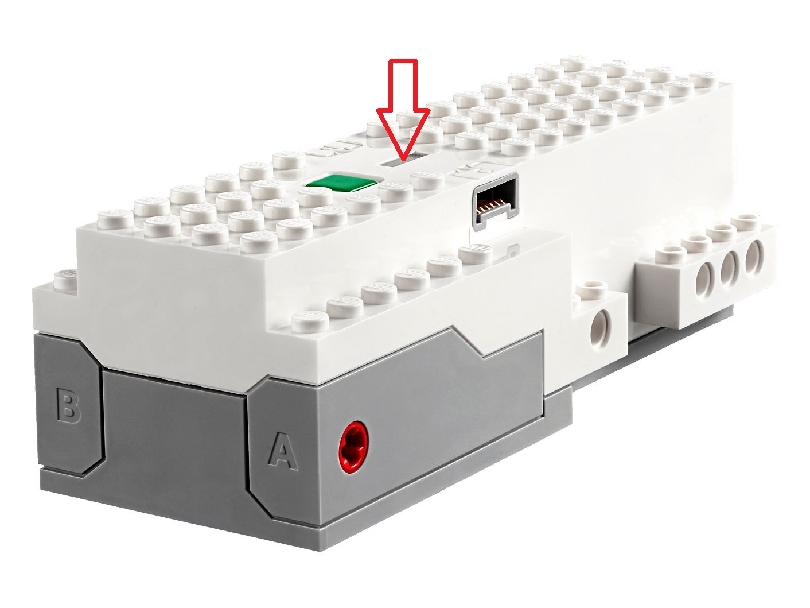

## LED light on the LEGO BOOST Hub

* **flashing blue** - The light on your LEGO® BOOST Move Hub should flash white for about 10-20 seconds
  [while connecting](https://www.lego.com/en-us/service/help/products/electronics-robotics/boost/connecting-the-lego-boost-app-to-the-move-hub-with-bluetooth-408100000009480)
  to the LEGO® BOOST app and remain a solid blue once connected.
* **permament blue** - connected to a tablet - all OK.
* **short flashing white** - search for the tablet (pairing mode)
* **long flashing white** - reset was carried out (after pressing the green button for 10 seconds)
* **flashing orange** - battery weak
* **flashing red, green, blue** - LEGO® BOOST app pushes an 
  [automatic firmware update](https://www.lego.com/en-us/service/help/products/electronics-robotics/boost/the-light-on-my-lego-boost-move-hub-keeps-flashing-different-colors-408100000009479)
  to your Move Hub using the Bluetooth connection. When this happens, the light on the Hub with alternate 
  between red, green and blue while it’s doing this.
